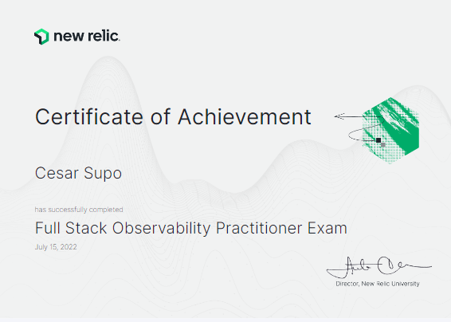

# Observability in New Relic
Observability challenge with New Relic and Platzi

## platzi route certificates


* [Docker](https://platzi.com/p/cesarmsq/curso/2066-docker/diploma/detalle/)
* [New Relic](https://platzi.com/p/cesarmsq/curso/3215-new-relic/diploma/detalle/)
* [DevOps](https://platzi.com/p/cesarmsq/curso/1431-devops/diploma/detalle/)


## FoodMe App DashBoard

* [Web App glitch.me](http://chipped-hail-wax.glitch.me/#/customer)


## Used NRQL Queries

### Troughput
```sql
SELECT count(*) FROM Transaction
```

### avg duration
```sql
SELECT average(duration) FROM PageView SINCE 1 week ago COMPARE WITH 1 day ago
```

### Count visits
```sql
SELECT count(*) FROM PageView FACET appName 
```

### Max duration (transaction)
```sql
SELECT max(duration) FROM Transaction 
```

### Count status code
```sql
SELECT count(*) FROM Transaction FACET http.statusCode
```

### Transaction AVG in FoodMe
```sql
SELECT average(duration) FROM Transaction WHERE appName = 'FoodMe'
```

### Slower cities
```sql
SELECT max(duration), average(duration) FROM PageView FACET city
```

### Average transaction duration
```sql
SELECT average(duration) FROM Transaction FACET name SINCE 1 week ago
```

### Visit by country
```sql
SELECT max(duration), average(duration) FROM PageView FACET city
```

## New Relic exam

* [Certificate of achievement](https://scl.io/lWPRpwQ)